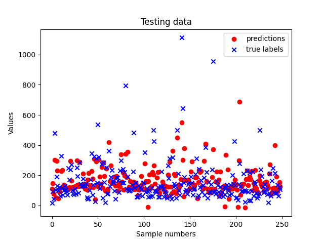

# MODELLING AIRBNB'S PROPERTY LISTING DATASET

This project consists in building a framework to systematically train, tune, and evaluate models on several tasks that are tackled by the Airbnb team.

The information available are images of the properties and tabular data, which contains information such as ID, category, price, number of beds or different ratings. 

## DATA PREPARATION

The first task to approach is preparing the data so it is suitable for modelling. 

Before building the framework, the dataset has to be structured and clean. 
Inside the files, there is a tabular dataset with the following columns:

- ID: Unique identifier for the listing
- Category: The category of the listing
- Title: The title of the listing
- Description: The description of the listing
- Amenities: The available amenities of the listing
- Location: The location of the listing
- guests: The number of guests that can be accommodated in the listing
- beds: The number of available beds in the listing
- bathrooms: The number of bathrooms in the listing
- Price_Night: The price per night of the listing
- Cleanliness_rate: The cleanliness rating of the listing
- Accuracy_rate: How accurate the description of the listing is, as reported by previous guests
- Location_rate: The rating of the location of the listing
- Check-in_rate: The rating of check-in process given by the host
- Value_rate: The rating of value given by the host
- amenities_count: The number of amenities in the listing
- url: The URL of the listing
- bedrooms: The number of bedrooms in the listing

The file [tabular_data.py] is created to manage that tabular data, and perform its cleaning process.

The function [remove_rows_with_missing_ratings(df)] performs this filtering in the ratings

    df = df[~df['Cleanliness_rating'].isna()]

The description column contains lists of strings that pandas does not recognise as such, instead it recognises them as strings. All of the lists begin with the same pattern, so a nested function is created with an if/else statement. If this condition is satisfied, the function ast.literal_eval is used to transform those strings into lists:

    if isinstance(row['Description'], str) and row['Description'].strip().startswith('['):
            row['Description']= ast.literal_eval(row['Description'])

            return row

However, there is one row where the elements from the description column are shifted one column to the right, so the element in description has to be deleted and all of the rest should be shifted from the 'Amenities' column to the left by one position:

    elif not isinstance(row['Description'], str) or not row['Description'].strip().startswith('[') and row['Amenities'].strip().startswith('['):
    row['Description'] = row['Amenities']
    row['Amenities'] = row['Location']
    row['Location'] = row['guests']
    row['guests'] = row['beds']
    row['beds'] = row['bathrooms']
    row['bathrooms'] = row['Price_Night']
    row['Price_Night'] = row['Cleanliness_rating']
    row['Cleanliness_rating'] = row['Accuracy_rating']
    row['Accuracy_rating'] = row['Communication_rating']
    row['Communication_rating'] = row['Location_rating']
    row['Location_rating'] = row['Check-in_rating']
    row['Check-in_rating'] = row['Value_rating']
    row['Value_rating'] = row['amenities_count']
    row['amenities_count'] = row['url']
    row['url'] = row['bedrooms']
    row['bedrooms'] = row[19]
    row[19] = np.nan

    row['Description']= ast.literal_eval(row['Description'])

Lastly, repeated string pieces are removed and the list is joined as a string, getting the description as a full text:

    df['Description'] = df['Description'].apply(lambda x: [item for item in x if item != ''])
...

    df['Description'] = df['Description'].apply(lambda x: ' '.join(x))

Some columns such as beds or guests have empty values that cannot be set to 0, therefore they are set to 1 with the function [set_default_feature_values(df)]

     df['guests'] = df['guests'].apply(lambda x: 1 if pd.isnull(x) else x)

All these functions are called from a function called [clean_tabular_data(raw_dataframe)]that returns the processed data.

In order to use this data for modelling, the data needs to be separated into features and labels. 

For now, the columns including text data are filtered out, and just the numeric tabular data is used, which is transformed to numpy arrays format to be suitable for modelling. 
[load_airbnb(df= pd.DataFrame , label=str)] is created to separate the dataset into two sets containing a label and features. 

## CREATING A REGRESSION MODEL

For this task, it is useful to use the sklearn library, as it contains several models and functions that are used for machine learning modelling. A new file [modelling.py] is created.

The data is loaded from the previous script, and the label selected is 'Price_Night'. Therefore, the aim is to train and test different models into guessing the Price_Night according to the relations of the different features with the training labels. 

    dataset =tabular_data.load_airbnb(df= df_1, label= 'Price_Night')

    X, y = dataset

For testing purposes, the data is split 70/30 into training and testing:

    X_train, X_test, y_train, y_test = train_test_split(X, y, test_size= 0.3) # splitting dataset

The first model used is a Stochastic Gradient Descent Regressor, which supports different loss functions and penalties to fit linear regression models. This model is well suited for regression problems with a large number of training samples. 

    myModel = SGDRegressor().fit(X_train, y_train)

Predictions are made on the training and testing data:

    y_train_pred = myModel.predict(X_train)
    y_test_pred = myModel.predict(X_test)

To test the performance of the model, RMSE and r2 are calculated:

- RMSE (training set): 96.10435783399384
- R2 (training set): 0.42403429169597195

These values indicate poor model performance. Ideally, RMSE would be around 0. This value suggests that there is some level of prediction error. On the other hand an r2 value of 0.42 means that only 42% of the variability in the target variable can be explained by the model. 

On the testing set, a similar result is obtain. As expected, RMSE is higher, as this is the testing data and the error is expected to be higher, and only 37.7% of the variability in the target variable can be explained by the model.

- RMSE (test set): 106.04102194634366
- R2 (test set): 0.377140169198409

Given those results, the best way to improve the metrics is by hyperparameter tuning. 

## HYPERPARAMETER TUNNING

A function called ustom_tune_regression_model_hyperparameters() is created to custom tune the parameters of the model by grid search from scratch. The function takes as arguments:

    def custom_tune_regression_model_hyperparameters(model_class: type, train_set, val_set, test_set, grid = dict):

- Model class
- Training set
- Validation set
- Testing set
- A dictionary with key value pairs that contain each hyperparameter and their different values

This function performs a manual grid search to obtain the best hyperparameters for the model. With the use of itertools, iterations over all the combinations of parameters can be performed:

    combinations = itertools.product(*grid.values())

The grid values are the following:

    parameter_grid = {

    'penalty': ['l1', 'l2', 'elasticnet', None],
    'loss' : ['squared_error', 'huber', 'epsilon_insensitive', 'squared_epsilon_insensitive'],
    'alpha' : [0.1, 0.01, 0.001, 0.0001],
    'learning_rate': ['constant', 'optimal', 'invscaling', 'adaptive'],
    'max_iter': [1000, 10000, 50000]

    }

First, the function trains the model with the training set. Then, it iterates over all combinations possible and makes predictions for the validating set. With that data, it calculates r2 and RMSE, and selects the highest r2 score to be the best one. 

------ THIS PART NEEDS TO BE RE-RUN BECAUSE r2 was not comparing the validation set

Best score is: 0.42403429169597195
Ideal hyperparameters for the model are: ('l1', 'squared_error', 0.1, 'constant', 1000)

While an R2 score of 0.42 indicates some level of predictive power, it suggests that there is still a significant portion of the target variable's variation (~58%) that the model is unable to explain. There is still room for improvement.

-------

Sk-learn provides a grid search algorithm (GridSearchCV) that already does all that work for the user. A new function called tune_regression_model_hyperparameters() is created to make use of this algorithm and compare with the previous result, where it was done manually. The function takes the same arguments as earlier, and creates an instance of the GridSearchCV class:

    grid_search = GridSearchCV(estimator= model, param_grid= grid, scoring= 'r2', cv= 5)

This object already provides all the data necessary to make a valoration of the model's performance. The results obtained are:

Best score is: 0.3837917450772203
Ideal hyperparameters for the model are: {'alpha': 0.1, 'learning_rate': 'optimal', 'loss': 'squared_epsilon_insensitive', 'max_iter': 10000, 'penalty': 'elasticnet'}

Rarely, the best score is lower than the one obtained performing the grid search manually, and the ideal parameters also change. 

##  FINDING THE BEST REGRESSOR MODEL

In order to evaluate different types of regression models, a function called evaluate_all_models() is created. This function passes different regressors into the function tune_regression_model_hyperparameters(), that makes use of sci-kit learn grid search to find the best hyperparameters for each model, and measure their performance.

The models tested are:
- Stochastic Gradient Descent Regressor
    - 
- Decision Tree Regressor
    - Versatile and can handle both numerical and categorical data
    - Easy to interpret, as the tree structure provides clear rules for decision-making
    - Able to capture non-linear relationships and interaction between variables
    - Robust to outliers and can handle missing values
- Random Forest Regressor
- Gradient Boosting Regressor

For each model, a different grid has been created, with different values for hyperparameters. The function evaluate_all_models(), does a grid search of these hyperparameters and extracts the best model, hyperparameters and metrics for each of them. After that, it saves them in the local folder models/regression. 

In order to find the best model, a function called find_best_model() is applied. This function basically compares the metrics of all the stored models in the previous step, and returns the characteristics of the model with the highest r2. 

The best model turned out to be SGDRegressor, with a r2 score of 0.3837917450772203. The ideal parameters for it were: 

    {"alpha": 0.1, "learning_rate": "optimal", "loss": "squared_epsilon_insensitive", "max_iter": 10000, "penalty": "elasticnet"}

''' THINGS TO IMPROVE: GRADIENT BOOST TAKES REALLY LONG, analyse better the parameters so that we remove the unnecessary and it does not take that long to run. '''

## BUILDING A CLASSIFICATION MODEL

In order to study if properties in the dataset can be separated by category depending on their features, a classification model (Logistic Regression) has been implemented. This time, the label is 'Category'.
Ideally, the model would classificate the different properties in their corresponding categories according to the features that properties of the same category have in common.

To study the classification performance, confussion matrices have been plotted, and different metrics have been analysed:

In this first image, the Confusion Matrix for training data can be observed.

The metrics for the training data show:
- Accuracy = 0.43201376936316693
- Precision = 0.4396341816930052
- Recall = 0.41982557364836615
- F1 score = 0.4136005969989438

As the accuracy is relatively low, this is an indication that the model is only predicting correctly around 43% of the time. 
This last F1 score suggests that the model's performance on the training data is relatively low in terms of both precision and recall. A lower F1 score indicates that the model struggles to achieve both high precision and high recall simultaneously. This could imply that the model is either missing many positive instances (low recall) or incorrectly classifying too many instances as positive (low precision). 

The metrics for the test data show:
- Accuracy = 0.3815261044176707
- Precision = 0.382529317814238
- Recall = 0.3804497354497355
- F1 score = 0.3591211866770788

As expected in testing data, all the metrics are lower than in training data. Overall, the values indicate that the model's performance is really low, with accuracy, precision, recall, and F1 all around 38%. It may be necessary to further evaluate the model, explore alternative approaches or techniques, and consider potential improvements to enhance the model's performance. 

